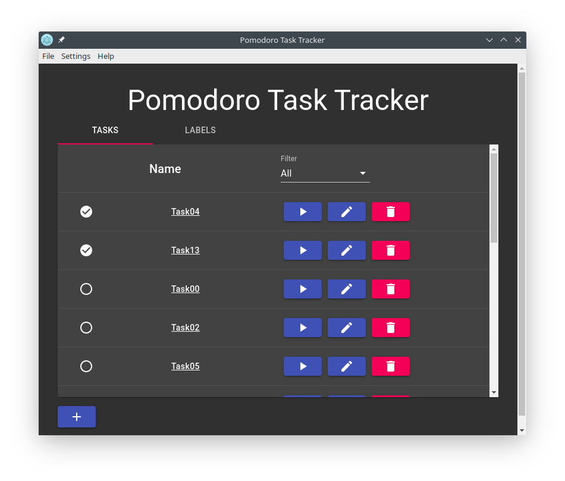

Pomodoro Task Tracker
======================================

### Table of Contents
1. [Purpose](https://gitlab.com/jeremymreed/pomodoro-task-tracker#purpose)
2. [Usage](https://gitlab.com/jeremymreed/pomodoro-task-tracker#usage)
3. [Config](https://gitlab.com/jeremymreed/pomodoro-task-tracker#license)
4. [Debugging](https://gitlab.com/jeremymreed/pomodoro-task-tracker#debugging)
5. [License](https://gitlab.com/jeremymreed/pomodoro-task-tracker#license)

Screenshot:
[](https://gitlab.com/jeremymreed/pomodoro-task-tracker/-/blob/master/images/task-list-with-task-done.png)

# Purpose:
This is an electron app to track tasks, using the pomodoro technique.

This software supports the [Luxafor Flag](https://luxafor.com).  If the Luxafor flag hardware is set up and connected,
the software will use the flag to display the current state of the pomodoro timer.
It will light up as follows:
   Steady Red: Working.
   Steady Green: Resting.
   Strobing Red: It's time to start working.
   Strobing Green: It's time to take a rest.

[Setting up a Luxafor Flag](https://luxafor.helpscoutdocs.com/article/6-luxafor-flag-set-up-and-use)
[Linux instructions](https://github.com/jonathonball/fabufor)

Warning: This software is very much alpha quality.  Do not use this to track tasks in a production environment.

I have only tested this software on Linux.  (I use Manjaro KDE)

# Usage:

You will need to have [nodejs and npm](https://nodejs.org/en/) installed on your machine to use this software.

Clone this repository. Go into the pomodoro-task-tracker directory.

Run:
```
npm ci && npm run rebuild-usb
```

PRODUCTION:

Build the software and install the database:
```
npm run build && npm run installDB
```

For testing purposes, you might want to seed the database with some test data:
```
npm run seed
```

Then run:
```
npm start
```

DEVELOPMENT:

Build the software and install the database:
```
npm run build && npm run installDB-dev
```

For testing purposes, you might want to seed the database with some test data:
```
npm run seed-dev
```

Then run:
```
npm start-dev
```

# Config:

This program has a settings editor that can be accessed from the main screen.

On Linux:  The settings are stored in ~./config/pomdoro-task-tracker/settings.json

# Debugging:

If you need to debug this app, you can turn debugging on by:

You can enable dev tools by going to Help -> Toggle Developer Tools.

Electron:
Set these environment variables, then run the software: (Source: https://github.com/electron/electron/issues/4677#issuecomment-193141998)
```
export ELECTRON_ENABLE_LOGGING=1
export ELECTRON_ENABLE_STACK_DUMPING=1
npm start
```

PouchDB:
In src/windows/app.js, uncomment the db.enableDebug() line.
To disable debug, you'll need to add db.disableDebug(), and comment out the enableDebug() call.
(I am going to make this a togglable option under Edit, similar to enabling dev tools)

# License:
This program is licensed under the GPLv2 License.
